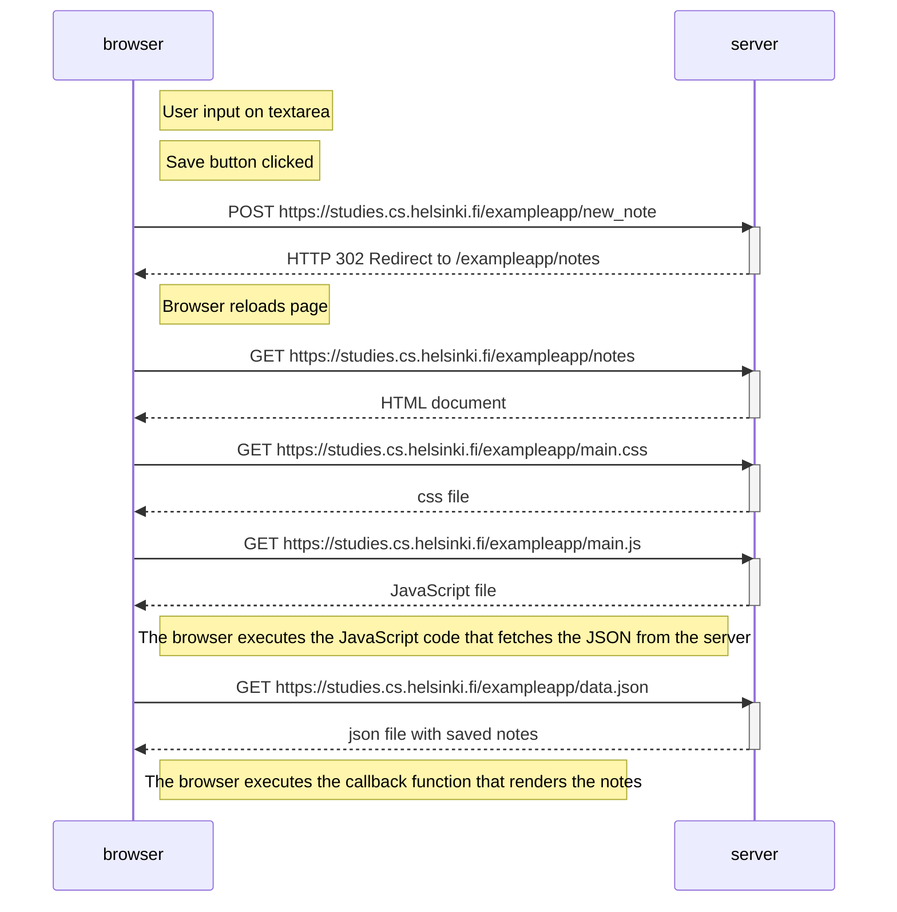

```mermaid
sequenceDiagram
    participant browser
    participant server

    Note right of browser: User input on textarea
    Note right of browser: Save button clicked

    browser->>server: POST https://studies.cs.helsinki.fi/exampleapp/new_note
    activate server
    server-->>browser: HTTP 302 Redirect to /exampleapp/notes
    deactivate server

    
    
    Note right of browser: Browser reloads page
    browser->>server: GET https://studies.cs.helsinki.fi/exampleapp/notes
    activate server
    server-->>browser: HTML document
    deactivate server

    browser->>server: GET https://studies.cs.helsinki.fi/exampleapp/main.css
    activate server
    server-->>browser: css file
    deactivate server

    browser->>server: GET https://studies.cs.helsinki.fi/exampleapp/main.js
    activate server
    server-->>browser: JavaScript file
    deactivate server

    Note right of browser: The browser executes the JavaScript code that fetches the JSON from the server

    browser->>server: GET https://studies.cs.helsinki.fi/exampleapp/data.json
    activate server
    server-->>browser: json file with saved notes
    deactivate server

    Note right of browser: The browser executes the callback function that renders the notes

```